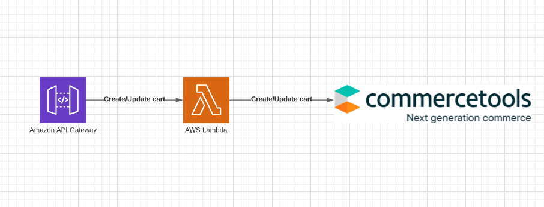

# cart-service-commercetools (MACH example)

Open-source hands-on guide to build real production ready cart-service using commercetools platform

## Architecture overview



## Build

`ENV=dev0x yarn build`

## Deploy

If build is packaged:
`ENV=dev0x yarn deploy-package`

Deploy entirely:
`ENV=dev0x yarn deploy`

To specify custom profile:
`ENV=dev0x PROFILE=local yarn deploy`

To specify another region
`ENV=dev0x PROFILE=local REGION=us-west-2 yarn deploy`

## Request examples
Replace `{host}`, `{env}`, `{api-key}`, `{cart-id}` with appropriate values

### Create cart
```
curl --location --request POST 'https://{host}/{env}/carts' \
--header 'x-api-key: {api-key}' \
--header 'Content-Type: application/json' \
--data-raw '{
    "currency": "USD",
    "items": [{
        "sku": "sku-123",
        "quantity": 1
    }]
}'
```

### Add line item to cart
```
curl --location --request PATCH 'https://{host}/{env}/carts/{cart-id}/lineitems' \
--header 'x-api-key: {api-key}' \
--header 'Content-Type: application/json' \
--data-raw '{
    "items": [{
        "sku": "sku-123",
        "quantity": 4
    }]
}'
```

### Add discount code to cart
```
curl --location --request POST 'https://{host}/{env}/carts/{cart-id}/discountcodes' \
--header 'x-api-key: {api-key}' \
--header 'Content-Type: application/json' \
--data-raw '{
    "discountCode": "discount123"
}'
```

### Set shipping address to cart
```
curl --location --request POST 'https://{host}/{env}/carts/{cart-id}/shippingaddress' \
--header 'x-api-key: {api-key}' \
--header 'Content-Type: application/json' \
--data-raw '{
    address" : {
        "id" : "exampleAddress",
        "key" : "exampleKey",
        "firstName" : "Example",
        "lastName" : "Person",
        "streetName" : "Examplary Street",
        "postalCode" : "80933",
        "city" : "Exemplary City",
        "region" : "Exemplary Region",
        "state" : "Exemplary State",
        "country" : "DE",
        "building" : "Hightower 1",
        "apartment" : "247",
        "phone" : "+49 89 12345678",
        "mobile" : "+49 171 2345678",
        "email" : "mail@mail.com"
    }
}'
```

### Set shipping method to cart
```
curl --location --request POST 'https://{host}/{env}/carts/{cart-id}/shippingmethod' \
--header 'x-api-key: {api-key}' \
--header 'Content-Type: application/json' \
--data-raw '{
    shippingMethodId" : "sm123"
}'
```


### Set payment method to cart
```
curl --location --request POST 'https://{host}/{env}/carts/{cart-id}/paymentmethod' \
--header 'x-api-key: {api-key}' \
--header 'Content-Type: application/json' \
--data-raw '{
    paymentMethodId" : "pm123"
}'
```
